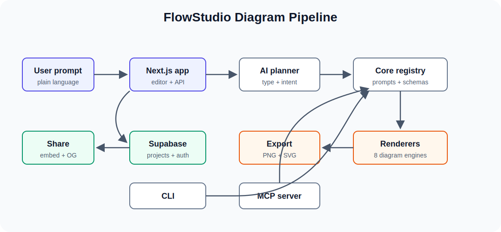
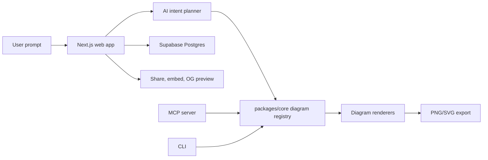

# FlowStudio

FlowStudio is an AI-powered diagram studio for turning plain-language prompts into polished diagrams, charts, architecture maps, process models, and shareable exports.

[Live app](https://web-govw.vercel.app) · [Repository](https://github.com/gwaghmar/FLOWSTUDIO)



## What It Does

- Generates the right diagram type from a short prompt.
- Supports 8 diagram engines: Mermaid, Excalidraw, React Flow, ECharts, Nivo, tldraw, BPMN, and cloud architecture diagrams.
- Exports exact-size PNG and SVG assets for docs, decks, social posts, and embeds.
- Saves projects with revision history, public share links, iframe embeds, and real Open Graph previews.
- Supports multi-provider AI through OpenAI, Anthropic, Google, Groq, and Mistral.
- Includes Auth.js, Supabase/Postgres persistence, Stripe billing, API keys, and an MCP server for agent workflows.

## Architecture

The app is a pnpm monorepo with a Next.js web app, shared diagram logic, a CLI package, and an MCP server.



Mermaid source for the diagram image lives in [`docs/assets/flowstudio-architecture.mmd`](docs/assets/flowstudio-architecture.mmd).

## Tech Stack

- Next.js 16 App Router, React 19, TypeScript, Tailwind CSS
- Drizzle ORM with Supabase/Postgres
- Vercel AI SDK with OpenAI, Anthropic, Google, Groq, and Mistral providers
- Mermaid, Excalidraw, React Flow, ECharts, Nivo, tldraw, and bpmn-js
- pnpm workspaces with `apps/web`, `packages/core`, `packages/cli`, and `packages/mcp-server`

## Quick Start

```bash
pnpm install
cp .env.example apps/web/.env.local
pnpm --filter @flowchart/web db:push
pnpm dev
```

Open `http://localhost:3040`.

For local development without Postgres, set `MOCK_DB=true` in `apps/web/.env.local`.

## Environment

Copy `.env.example` to `apps/web/.env.local` and configure the values you need:

- `DATABASE_URL` for Supabase/Postgres
- `AUTH_SECRET` for Auth.js
- `NEXT_PUBLIC_SUPABASE_URL` and `NEXT_PUBLIC_SUPABASE_ANON_KEY` for production auth
- At least one hosted AI provider key, such as `OPENAI_API_KEY` or `GOOGLE_GENERATIVE_AI_API_KEY`
- Stripe values if billing is enabled

## Scripts

```bash
pnpm dev          # run the web app
pnpm build        # build core and web packages
pnpm lint         # run workspace lint tasks
pnpm test:unit    # run Node unit tests
pnpm test         # run Playwright tests
pnpm mcp:dev      # run the MCP server
```

## Deploy

1. Import the repository into Vercel.
2. Set the Vercel root directory to `apps/web`.
3. Add the production environment variables from `.env.example`.
4. Connect a Supabase Postgres database and run `pnpm --filter @flowchart/web db:push`.

## Project Status

FlowStudio has shipped the core editor, AI generation, save/share/embed workflows, brand kit support, templates, real OG previews, streaming Mermaid preview, and cloud architecture diagrams.

Current polish focus: source editor ergonomics, more layout helpers, template recommendations, and public profile pages.
